# TapeMate64 - Connect your Commodore Datasette to a PC

**TapeMate64** is a compact and affordable USB adapter that lets you connect a **Commodore Datasette** to your PC via **USB** for both reading and writing cassette data. It enables you to **digitize original tapes** for archiving or for use in an emulator—without needing a working Commodore 64.

It also allows you to **write TAP images back to real cassette tapes**, so you can enjoy software on original hardware for the full retro experience.

Based on the [TapeBuddy64](https://github.com/wagiminator/C64-Collection/tree/master/C64_TapeBuddy64) project, TapeMate64 adds a builder-friendly design. You can operate it via a command-line interface or a Python-based graphical front-end.

The main differences of TapeMate64 over the original TapeBuddy64 project are:

* It uses readily available and popular modules that are easy to order online, such as the **Arduino Nano Super Mini** and the **MT3608** boost converter.
* All modules and components are soldered using **Through-Hole Technology (THT)**, which is much simpler to solder than Surface-Mount Device (SMD) components.
* The original TapeBuddy code was **ported to the ATmega** microcontroller used by the Arduino board, which is a much more common CPU than the original.
* The software was also modified to provide **better precision** for long and short pulses.
* Enhanced CRC computation has been added for improved data integrity.
* The applications (GUI and command-line) are precompiled and ready to use, so there is no need to install Python.
* No switch is required for programming or operation, everything is handled automatically.
* Additional special-case handling was implemented, particularly for tape-writing operations.

_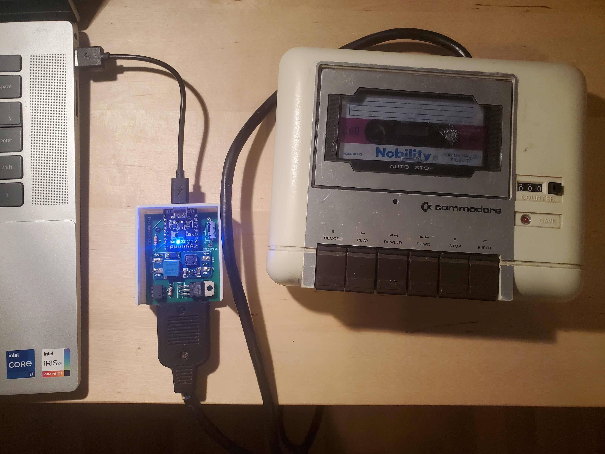_
_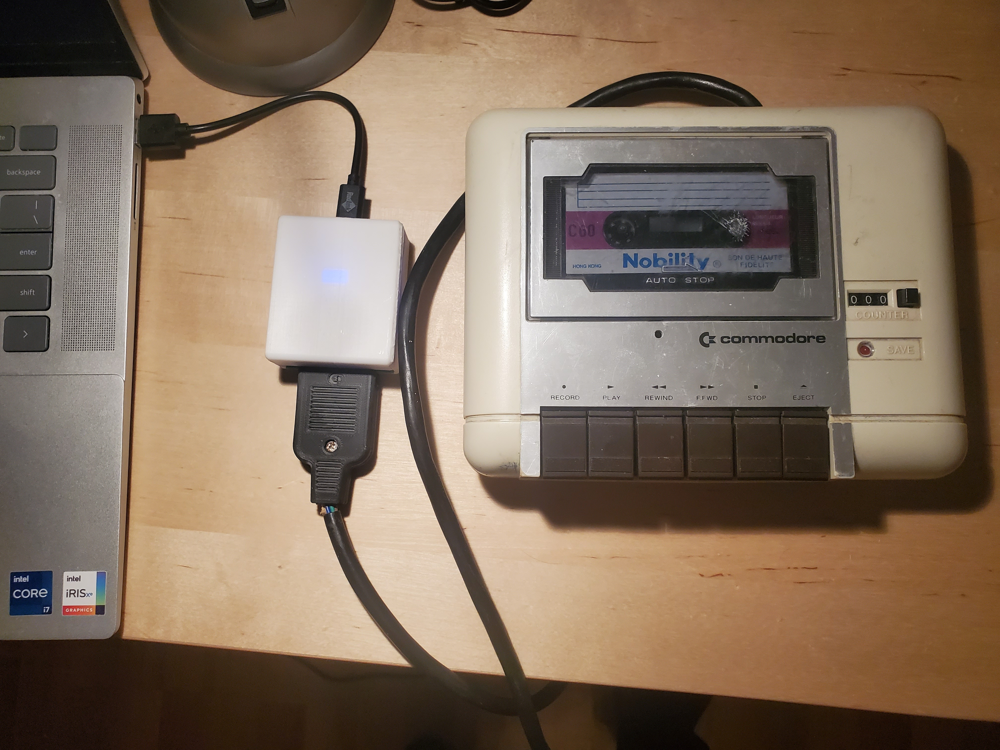_

---

# Where to Order a Kit

I will have some kits for sale at the [World of Commodore](https://woc.tpug.ca/) event, organized by **TPUG**, during the weekend of **December 6-7, 2025**. Any remaining kits will be sold online after the event.

---

# Instructions to Assemble the Board

To properly build and calibrate your TapeMate64, please follow the steps in the [build instructions](build_guide/BUILD.md). **Carefully adjusting the MT3608 is very important** to avoid damaging your Datasette.

---

# Firmware and Application Download Release

The latest application release can be [downloaded here](https://github.com/heneault/TapeMate64/releases/latest). Download the zip file corresponding to your operating system (**Windows or Linux**). Extract the entire zip file to access the different applications.

## Installing Windows Driver

Windows users may need to install a [driver](https://www.wch-ic.com/downloads/ch341ser_exe.html) for the **CH340N USB-to-serial adapter**. If the application does not detect the board, install the driver, reboot your PC, and try again.

## Uploading the Firmware

* Connect the device to a **USB port** on your PC.
* Use one of the following methods:

### If using the Graphical Front End (Recommended)

* Execute the following command on your PC: `tape-gui.exe`.
* Click on **<kbd>Flash firmware</kbd>**.

### If using the Command Line Tool

* Execute the following command on your PC: `flash-firmware.exe`.

---

# Operating Instructions

## Preparation

* Connect your **TapeMate64** to your **Commodore Datasette**.
* Connect your **TapeMate64** to a **USB port** on your PC.
* Ensure that you have properly flashed the firmware.
* Safety Note: Always disconnect from the **USB port** before unplugging the **Commodore Datasette**.

## Command Line Interface

The following command-line tools are available:

### Reading from Tape

* Execute the following command on your PC: `tape-read.exe outputfile.tap`.
* Press **<kbd>PLAY</kbd>** on your Datasette when prompted.
* The dumping process is **fully automatic**. It stops when the end of the cassette is reached, when no more signal is detected on the tape for a certain period, or when the **<kbd>STOP</kbd>** button on the Datasette is pressed.

### Writing on Tape

* Execute the following command on your PC: `tape-write.exe inputfile.tap`.
* Press **<kbd>RECORD</kbd>** on your Datasette when prompted.
* The recording process is **fully automatic**. It stops when all data has been written, the end of the cassette is reached, or when the **<kbd>STOP</kbd>** button on the Datasette is pressed.

## Graphical User Interface

* Execute the command on your PC: `tape-gui.exe`.
* The rest of the operation should be self-explanatory.

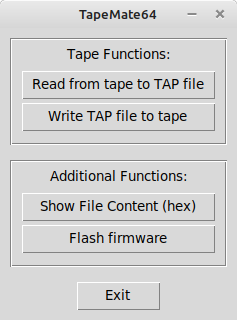
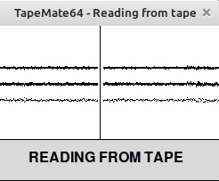
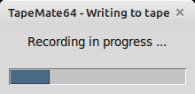

## Status LEDs

|LED|Description|
|:-|:-|
|**Blue**|**Steady:** Device is powered via USB.|
|**Green**|**Steady:** Device is reading from the tape. **Flashing:** Device waits for the **<kbd>PLAY</kbd>** or **<kbd>STOP</kbd>** button to be pressed.|
|**Red**|**Steady:** Device is writing to the tape. **Flashing:** Device waits for the **<kbd>RECORD</kbd>** or **<kbd>STOP</kbd>** button to be pressed.|

## Troubleshooting Tips

If you experience **buffer underrun or overrun** errors, especially on Windows, please check the following:

* **Windows is not a real-time OS**, so if another process preempts the application for too long, the serial port transfer can fail.
* **Antivirus:** Make sure your antivirus software is not running a scan.
* **Screen Saver:** Disable any screen saver that could consume too much CPU.
* **Other Applications:** Do not run any other demanding applications simultaneously.
* **CPU Usage:** Monitor your CPU usage using the Task Manager (it should be relatively low if nothing else is running).
* **Administrator Mode:** Try running the application in administrator mode. You can do this by right-clicking the application's shortcut and selecting **"Run as administrator,"** or by opening a command shell (search for "cmd," then right-click on "Command Prompt" and select "Run as administrator"), navigating to the application's folder, and launching it manually.
* **Older Computers:** On older computers, the command-line tools are sometimes more suitable than the GUI.

---

# Hardware Description

The schematic is shown below:

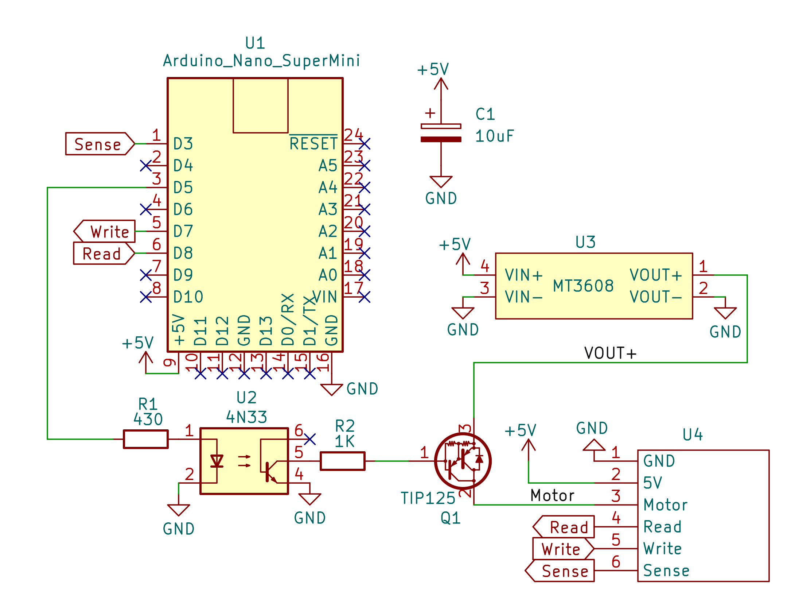

## Microcontroller

The heart of the system is an **Arduino Nano Super Mini**. This board is similar to a classic Arduino Nano but has a smaller footprint and includes onboard LEDs. It's a very popular board and includes the necessary voltage regulator and USB-to-serial chip, making it an excellent choice for this project. The USB port is used both for **flashing the firmware** and for **operating the device**. The microcontroller on the board is a widely supported **ATmega328**.

## Booster Converter

The **MT3608 boost converter** is used to provide the approximately **6 Volts** required for the Datasette's motor. The ATmega can switch the motor on and off via an optocoupler and a transistor when a key press is detected on the Datasette.

## Cassette Port

The cassette port is a **6-pin edge connector** integrated into the printed circuit board (PCB) with a **3.96mm** spacing. The Datasette's connector plugs directly onto this port. A notch between pins B/2 and C/3 prevents accidental polarity reversal.

|Pin|Signal|Description|
|:-|:-|:-|
|**A / 1**|GND|Ground|
|**B / 2**|+5V|5 Volt DC|
|**C / 3**|MOTOR|Motor Control, approx. 6 Volt power supply for the motor.|
|**D / 4**|READ|Data Input, read data from the Datasette.|
|**E / 5**|WRITE|Data Output, write data to the Datasette.|
|**F / 6**|SENSE|Detection, senses if one of the **<kbd>PLAY</kbd>**, **<kbd>RECORD</kbd>**, **<kbd>F.FWD</kbd>**, or **<kbd>REW</kbd>** keys is pressed.|

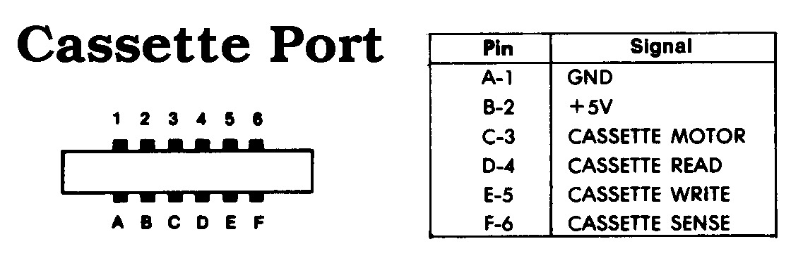

---

# Software

## Working Principle

Data is stored on the tape as a **frequency-modulated waveform**. This signal is read from the Datasette, amplified, converted into a **TTL-level square wave** with the same pulse lengths, and then output to the cassette port's **READ pin**. TapeMate64 reads this square wave and measures the **pulse durations** between the signal's falling edges. These pulse lengths are then sent to the PC via USB and written into the **TAP file** in the correct format after being adjusted using the clock frequency.

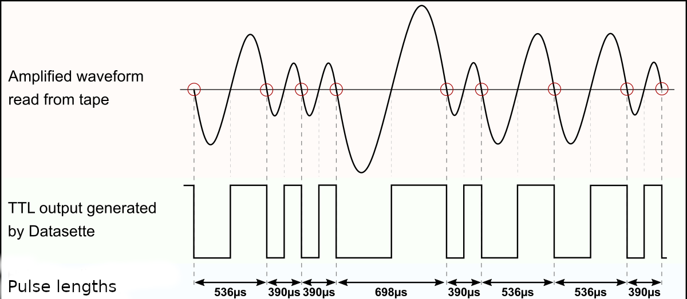

Writing to tape works in the opposite way. TapeMate64 generates a square wave with the corresponding pulse lengths based on the TAP data values (the signal is inverted when writing) and sends it through the **WRITE pin** to the Datasette, which then generates the corresponding waveform and records it onto the cassette.

## Interpretation of the Pulse Lengths

The actual data is encoded using a sequence of pulses of different lengths. The standard Commodore system uses patterns of three different pulse lengths: **short** ($390\mu\text{s}$), **medium** ($536\mu\text{s}$), and **long** ($698\mu\text{s}$).

* Each data byte is preceded by a **marker** consisting of a long pulse followed by a medium one.
* A **"0" bit** is represented by a short pulse followed by a medium one.
* A **"1" bit** is a medium pulse followed by a short one.
* Each byte on the tape ends with a **parity bit**.
* Combinations of long pulses with medium or short pulses are used as a byte marker or end-of-data marker.

However, **fast loaders** are often used, and each one uses different pulse lengths and patterns, which complicates the overall decoding. Fortunately, TapeMate64 does not need to decode the data. This is because **only the raw data**—the individual pulse lengths—is saved in the TAP file. The actual interpretation of these pulses is handled later by the C64 or a corresponding emulator.

## Timing Accuracy

The accuracy of the pulse lengths depends on various factors. For instance, not all motors in Datasettes run at exactly the same speed. Additionally, the C64 measures the pulse length via the CIA timer as the number of elapsed system clock cycles, but **PAL versions of the C64** have a different clock frequency ($985248 \text{ Hz}$) than **NTSC versions** ($1022730 \text{ Hz}$). Furthermore, badly aligned Datasette heads and old tapes with weakened signals also contribute to potential timing variations.

For these reasons, the difference between the individual pulse lengths used for data encoding is large enough to be reliably distinguished even under the circumstances mentioned. In fact, what matters is not the measured pulse length itself, but whether it is **above or below a defined threshold value**. Moreover, turbo loaders often employ a mechanism to synchronize with the data stream from the Datasette.

## TAP File Format

The **TAP file format** attempts to duplicate the data stored on a C64 cassette tape, bit for bit. It was designed by Per Håkan Sundell (author of the [CCS64](http://www.ccs64.com/) C64 emulator) in 1997. Since it is simply a representation of the raw serial data from a tape, it should be able to handle any custom tape loaders that exist. The layout is fairly simple, with a small **20-byte header** followed by the file data:

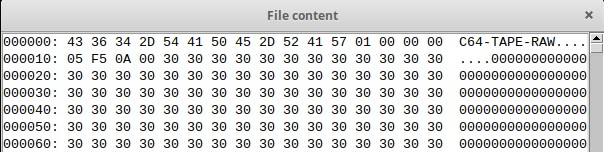

|Bytes (hex)|Description|
|:-|:-|
|0000-000B|File signature **"C64-TAPE-RAW"**|
|000C|TAP version (**0** - original, **1** - updated, **2** - halfwave extension)|
|000D|Computer platform (**0** - C64, **1** - VIC-20, **2** - C16, Plus/4, **3** - PET)|
|000E|Video standard (**0** - PAL, **1** - NTSC, **2** - OLD NTSC, **3** - PALN)|
|000F|Future expansion|
|0010-0013|File data size (**little endian**; not including the header)|
|0014-xxxx|File data|

In **TAP version 0**, each data byte in the file data area represents the length of a single pulse, determined by the following formula:
$$\text{data byte} = \frac{\text{pulse length (in seconds)} \times \text{C64 clock frequency (in Hertz)}}{8}$$

Therefore, the data value for a pulse length of $390\mu\text{s}$ would be:
$$0.000390\text{s} \times 985248\text{Hz} / 8 \approx 48 \quad (0\text{x}30 \text{ in hex})$$

A data value of **$0\text{x}00$** represents an **"overflow"** condition—any pulse length greater than $255 \times 8$ clock cycles (or $2078\mu\text{s}$). Such a pulse length does not encode any data and typically only occurs in the pauses between programs on the same tape. However, the lengths of these pauses can be relevant for some fast loaders.

In **TAP version 1**, the data value of **$0\text{x}00$** was re-coded to represent values greater than $255 \times 8$ clock cycles, or to provide a greater resolution (one clock cycle instead of eight). When a $0\text{x}00$ is encountered, it is followed by **three bytes** that represent the actual pulse length in C64 clock cycles. These three bytes are stored in **little-endian format** (least significant byte first). For example, a data value for a pulse length of $2875\mu\text{s}$ would be:
$$0.002875\text{s} \times 985248\text{Hz} \approx 2832 \quad (\text{data bytes: } 0\text{x}00, 0\text{x}10, 0\text{x}0\text{B}, 0\text{x}00)$$

**TAP Version 2** is an extension made by Markus Brenner for C16 tapes. It is based on Version 1, but each value represents a **halfwave**, starting with a '0' to '1' transition. The time encoding remains the same.

TapeMate64 can **read TAP versions 0 and 1** and **write them to cassette**. It uses **TAP version 1** to generate a TAP file when reading from the Datasette. The pauses between individual files on the tape are also precisely recorded, ensuring the device should be able to handle all types of fast loaders.

## Software Implementation

### Serial Interface

The Python scripts on the PC control the device via four simple serial commands:

|Command|Function|Response|
|:-:|:-|:-|
|**"i"**|Transmit identification string|**"TapeMate64\n"**|
|**"v"**|Transmit firmware version number|e.g. **"v1.0\n"**|
|**"r"**|Read file from tape|Send raw data stream|
|**"w"**|Write file on tape|Receive raw data stream|

### Reading from Tape

The ATmega measures the pulse lengths using its **Timer 1**.

1.  The timer counts continuously upwards at **2 MHz** until a **falling edge** is detected at the Datasette's READ output, or until a **timer overflow** occurs. A frequency of 2 MHz provides very good precision for reading the pulse.
2.  An **overflow interrupt** occurs every $32.768 \text{ ms}$ if no falling edge interrupt is detected. Overflows are accumulated until the falling edge interrupt occurs or a stop/timeout condition is met.
3.  When the falling edge occurs, the timer counter value is automatically added to any accumulated overflow.
4.  The final count is then **divided by 2** to adjust the value to the number of **microseconds**. This value is placed into a buffer queue to be sent to the PC. The timer counter and overflow are then reset to zero, and the process restarts.
5.  While there are no interrupts, the main program sends the value from the queue to the PC via the serial-to-USB port.
6.  Values are encoded as the number of microseconds using **3 bytes**.
7.  The raw data stream begins with a **$0\text{x}00$** as soon as **<kbd>PLAY</kbd>** on the tape is pressed.
8.  Pulse lengths shorter than $8\mu\text{s}$ are ignored.
9.  If **<kbd>STOP</kbd>** is pressed or a timeout occurs while waiting for valid pulses, the end of the stream is indicated by a **$0\text{x}000000$** word.
10. Afterwards, the **16-bit checksum** (calculated using CRC-16 of all data bytes) is transmitted.
11. Finally, the **tape buffer overflow flag** is transmitted as a single byte ($0\text{x}00$ means no overflow occurred).
12. If **<kbd>PLAY</kbd>** was not pressed within the defined initial period, a **$0\text{x}01$** is sent instead of $0\text{x}00$, and the procedure is terminated.

The Python script writes the TAP file header, converts the received data words into the corresponding TAP values, and writes them to the output file.

### Writing on Tape

1.  The Python script on the PC opens the TAP file and validates it.
2.  It converts all data from the TAP file into the corresponding **24-bit words** for transmission to the TapeMate64 and stores them in a temporary file.
3.  The script then sends the write command **"w"** to the TapeMate64.
4.  After receiving a **$0\text{x}00$** byte from the TapeMate64, which indicates that **<kbd>RECORD</kbd>** was pressed, the PC starts to send the first data packet after it is requested by the TapeMate64.
5.  The TapeMate64 temporarily stores the received data in a buffer. As soon as the buffer level drops below a certain point, it requests new data from the PC by sending a byte that indicates the number of values requested in the next packet.
6.  The ATmega uses its **Timer 1** to output a signal with a **50% duty cycle** by default at the cassette port's WRITE pin. Since Timer 1 runs at $2 \text{ MHz}$ and values are sent from the PC aligned to microseconds, the same value can be used for each half of the period to program the timer.
7.  When the timer interrupt is triggered, the handler first verifies whether it should create the **first or second half** of the cycle. After a full period, it continues with the next value from the buffer queue.
8.  If a value has a period longer than the maximum timer period ($32.768 \text{ ms}$), the timer is programmed with this maximum value, and bookkeeping is done to track the remaining period. On the next interrupt, the remaining period value is decremented until the timer has fully completed the cycle. This creates a very precise, **pulse-length modulated square wave**.
9.  If there is no more data in the TAP file, the Python script sends a **$0\text{x}000000$** word to indicate the end of the transfer.
10. TapeMate64 then sends back a **$0\text{x}00$** byte as soon as all data in the buffer has been output as pulses.
11. Finally, the **16-bit CRC16 checksum**, the **buffer underrun flag**, and the current status of the **<kbd>RECORD</kbd>** key are transferred to the PC. The Python script checks these values and reports whether the recording was successful.

### Addressing Writing Issues

**Long Pulses and Duty Cycle:** Very long pulses can sometimes cause the Datasette to misinterpret the signal. If we use a fixed 50% duty cycle, the signal will remain too long during the first half of a long pulse. This cause the Datasette's internal electronics to prematurely detect the pulse's edge and switch to the second half of the cycle, leading to recording errors (false pulses).

To avoid this, the implementation briefly adjusts the duty cycle at the beginning of a long pulse. It first quickly performs the required edge transition by outputting a very short pulse of the opposite polarity. After this quick transition, it holds the output steady for the remaining duration of the long pulse. This approach ensures a clean, sharp edge at the start of the pulse, preventing glitches or false triggers on the tape and guaranteeing reliable timing.

**Timer Interrupt Conflicts:** Another potential issue during writing occurs when a pulse period is slightly longer than the timer's maximum representable value. The timer would first wait for its maximum period, then wait for a very small remainder. If this remainder is too close to zero, the interrupt handler may not have enough time to react. The compare register could immediately re-trigger the interrupt while the current interrupt is still being processed. This results in the timer running past the intended point, overflowing to zero, continuing to count, and eventually triggering the interrupt much later than expected—producing an unintended, very long pulse. To prevent this, the code splits any pulse period that slightly exceeds the timer’s limit into two roughly equal halves. This guarantees that each timer period is long enough for the interrupt handler to run reliably and avoids spurious long pulses.

## Compiling the Firmware (For Developers)

Follow these steps to compile the firmware yourself:

1.  Visit [https://code.visualstudio.com/](https://code.visualstudio.com/).
2.  Download the installer for your operating system (Windows, macOS, or Linux).
3.  Run the installer and accept the default options.
4.  When the installation is complete, open **Visual Studio Code**.
5.  In VS Code, click the **Extensions** icon on the left sidebar (the four squares).
6.  In the search bar, type **PlatformIO IDE**.
7.  Click **Install** on the extension published by *PlatformIO Labs*.
8.  Wait for the installation to finish, then click **Reload Now** when prompted.
9.  You should now see the **PlatformIO (ant head)** icon in the left sidebar.
10. Select the folder containing the AVR project (`TapeMate64/software/avr`).
11. VS Code automatically recognizes it as a PlatformIO project.
12. The **PlatformIO Toolbar** appears at the bottom of the window (with **✓ Build**, **→ Upload**, and **Plug** icons).
13. PlatformIO will automatically install the necessary toolchains and libraries as defined in the `platformio.ini` file.
14. Click the **✓ Build** icon in the PlatformIO toolbar.
15. Watch the output panel for progress and errors.
16. When the process reports **“SUCCESS”**, your firmware has been compiled successfully and saved under `.pio/build/nanoatmega328/`.
17. Plug your board into your computer via USB.
18. Wait a few seconds for PlatformIO to detect it.
19. At the bottom bar, click the **PlatformIO: Devices** (plug) icon.
20. Note or select the correct serial port (e.g., `COM3` on Windows or `/dev/ttyUSB0` on Linux/macOS).
21. Click the **→ Upload** icon in the PlatformIO toolbar.
22. PlatformIO will compile (if needed) and then upload your program to the board.
23. When you see **“Uploading done”**, the process is complete.

## Installing Python for Application Development

If you want to modify the application running on the computer, you need to have **Python** installed on your PC. Most Linux distributions already include this. Windows users can follow these [instructions](https://www.pythontutorial.net/getting-started/install-python/).

You should also create a **virtual environment** to install the required dependencies, following these steps:

1.  Open a terminal and move into the project folder:
    `cd TapeMate64/software/pc`
2.  Create the virtual environment (`venv`):
    `python3 -m venv venv`
3.  Activate the virtual environment:
    `source venv/bin/activate`
4.  Install the requirements:
    `pip install -r requirements.txt`

## Checking, Cleaning, and Converting TAP Files

The TAP files generated by TapeMate64 can be used directly in your favorite emulator, but you might want to check, optimize, or convert them beforehand. This works perfectly with the command-line tool **[TAPClean](https://sourceforge.net/projects/tapclean/)**.

* **To check the quality** of the generated TAP image, use the following command:
    `tapclean -t outputfile.tap`
    *Remember that a TAP file is almost never 100% clean, as pauses in particular are not always correctly recognized.*
* **You can optimize the quality** of the file with the following command:
    `tapclean -o outputfile.tap`
    *This compensates for slight deviations in the pulse lengths and adapts everything to the exact timing specifications. TAPClean knows the required pulse lengths not only for the standard Commodore coding but also for all common fast loaders.*
* **If you want to convert the TAP file into a WAV audio file**, use the following command:
    `tapclean -wav outputfile.tap`

There is also a graphical [front end](https://www.luigidifraia.com/software/) available for TAPClean.

## Datasette Head Alignment

If you have trouble loading programs from tape, the **azimuth of the tape head** may be out of position. Before adjusting the azimuth, however, you should rule out all other causes of error:

1.  Try other cassettes first, as tapes will age over time and the signals will weaken.
2.  Clean the connector contacts with contact cleaner.
3.  Clean the read head with isopropyl alcohol.

If it still doesn't work, it's time for the screwdriver.

To adjust the azimuth, there is a tiny screw hole above the rewind button through which a small jeweler's screwdriver can fit. When the tape drive is playing, the hole will align with the head adjustment screw. **Do not apply too much pressure and avoid over-tightening or over-loosening the screw!**

Follow these steps:

1.  Insert a cassette into the Datasette that you know is working well.
2.  Execute `tape-gui.exe`.
3.  Select "Read from tape to TAP file," then select the output file (you can delete it later).
4.  Press **<kbd>PLAY</kbd>** on the Datasette when prompted.
5.  As soon as the pulse lines are displayed, take a thin screwdriver and **slowly adjust the azimuth until the displayed lines are as narrow as possible**.

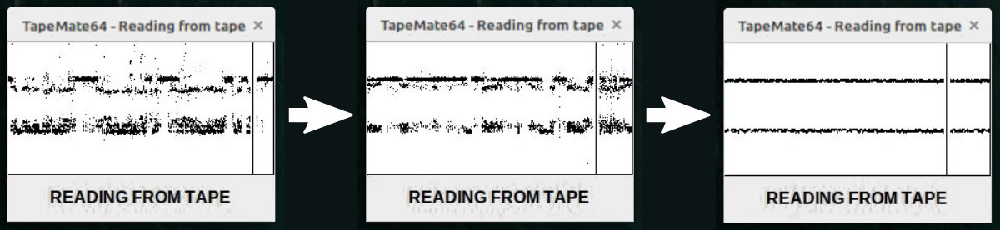
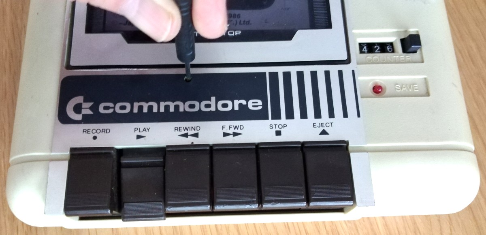

---

# References, Links and Notes

1.  [TapeBuddy64](https://github.com/wagiminator/C64-Collection/tree/master/C64_TapeBuddy64)
2.  [TrueTape64 Project](https://github.com/francescovannini/truetape64)
3.  [How Commodore Tapes Work](https://wav-prg.sourceforge.io/tape.html)
4.  [How TurboTape Works](https://www.atarimagazines.com/compute/issue57/turbotape.html)
5.  [Analyzing C64 Tape Loaders](https://github.com/binaryfields/zinc64/blob/master/doc/Analyzing%20C64%20tape%20loaders.txt)
6.  [Archiving C64 Tapes Correctly](https://www.pagetable.com/?p=1002)
7.  [TAP File Format](https://ist.uwaterloo.ca/~schepers/formats/TAP.TXT)
8.  [VICE Emulator File Formats](https://vice-emu.sourceforge.io/vice_17.html)
9.  [TAPClean](https://sourceforge.net/projects/tapclean/)
10. [TAPClean Front End](https://www.luigidifraia.com/software/)
11. [Datasette Service Manual](https://www.vic-20.it/wp-content/uploads/C2N-1530-1531-service_manual.pdf)
12. [Adjusting the Datassette Head Azimuth](https://theokoulis.com/index.php/2020/11/15/some-notes-on-adjusting-the-datassette-head-azimuth-on-the-vic-20/)
13. [ATmega Datasheet](https://ww1.microchip.com/downloads/aemDocuments/documents/MCU08/ProductDocuments/DataSheets/ATmega48A-PA-88A-PA-168A-PA-328-P-DS-DS40002061B.pdf)
14. [MT3608 Datasheet](https://components101.com/sites/default/files/component_datasheet/MT3608-Step-Up-Power-Module-Datasheet.pdf)
15. [Arduino Nano Super Mini](https://github.com/maltman23/ArduinoNanoSuperMini)

---

# License

This work is licensed under the Creative Commons Attribution-ShareAlike 3.0 Unported License.
(http://creativecommons.org/licenses/by-sa/3.0/)
