# TapeMate64 — Assembly & Calibration Guide

This guide explains how to assemble, flash, and calibrate your **TapeMate64** device step by step.

---

## 🧾 Bill of Materials (BOM)

| Qty | Component                     |
|-----|-------------------------------|
| 1   | TapeMate64 PCB                |
| 1   | Arduino Nano SuperMini V3     |
| 2   | Pin Headers                   |
| 1   | MT3608                        |
| 1   | TIP125                        |
| 1   | 4N33                          |
| 1   | 10 µF Electrolytic Capacitor  |
| 1   | 430 Ω Resistor                |
| 1   | 1 kΩ Resistor                 |

_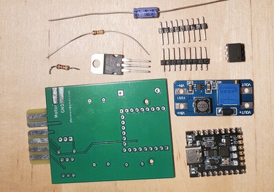_

- Note: USB Cable to connect to the computer is not showed nor included in kit.
---

## 🧰 Required Tools & Materials

- Soldering iron & solder  
- Small screwdriver  
- Wire cutters  
- Multimeter  
- USB cable
- A few small jumper/alligator wires  
- Electrical tape (optional for safety during adjustments)

---

## Step 1 — Header Installation

1. Insert the **two pin headers** into the PCB.  
   - The **longer pins** go through the PCB.  
   - Viewed from the top (where “TapeMate64” is printed), the **shorter pins** should be facing you.  
   - Double-check orientation before soldering.

_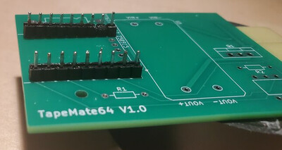_

---

## Step 2 — Mounting the Arduino Nano SuperMini

1. Insert the **Arduino Nano SuperMini** into the two headers.  
   - Ensure **all pins** are aligned and seated properly.

2. Solder **four corner pins** of the CPU header first.  
   - Flip the PCB and solder the four corner pins underneath.  
   - Make sure the board sits straight. If misaligned, reheat and adjust.

   _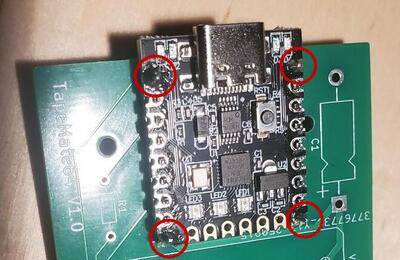_ _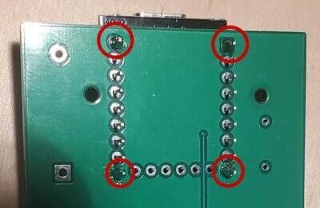_ _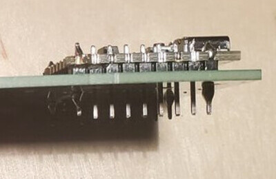_

3. When aligned, solder **all remaining header pins** (top and bottom).  
   - Avoid creating solder bridges between pins, always double check.

4. Trim any **excess pin length** underneath the PCB.

   _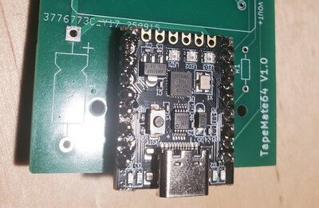_ _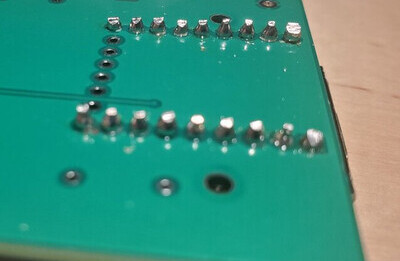_

---

## Step 3 — Install the MT3608 Module

1. Cut and solder **four small wires** in the PCB where the MT3608 connects.  
2. Position the MT3608 correctly and solder the wires through its four corner holes.  
3. Trim excess wire.

   _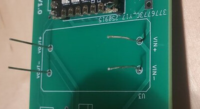_ _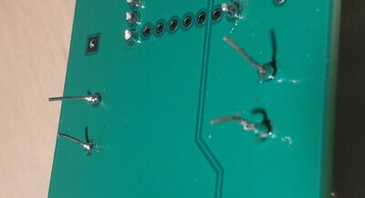_ _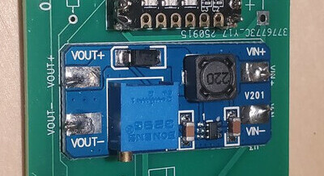_

---

## Step 4 — Install the 4N33 Optocoupler

1. Insert and solder the **4N33**.  
   - Pin 1 (marked by a dot) must match the the orientation in the picture.

_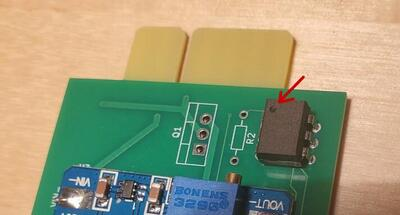_

---

## Step 5 — Add Supporting Components

1. Install and solder the **1 kΩ resistor (R2)** near the 4N33.  
   - Trim the leads underneath.

2. Install the **TIP125 transistor** next to R2.  
   - Do **not** push it fully flush with the PCB — leave a small gap so it can be bent later to fit the enclosure.  
   - Solder and trim leads.

3. Install the **430 Ω resistor** and the **10 µF electrolytic capacitor** near the Arduino.  
   - Respect capacitor **polarity (+ / –)**.  
   - Trim leads as needed.

   _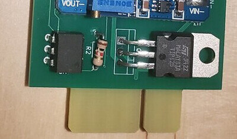_ _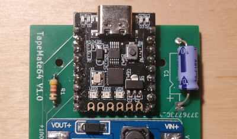_

---

## ⚙️ Step 6 — Firmware Flashing

⚠️ **Do NOT connect a datasette yet!**  
The Arduino must be flashed and the motor voltage adjusted first.

1. Download the [latest release](https://github.com/heneault/TapeMate64/releases/latest) of the application

2. Extract the archive and run **`tape-gui`**.

3. Connect the TapeMate64 to your computer via USB.

4. Click **“Flash Firmware”**.  
   - A progress bar will appear.  
   - When complete, click **OK**.  
   - If running on Windows and it does not detect the board, install the **CH340/CH341 driver**:  
     https://www.wch-ic.com/downloads/ch341ser_exe.html  
     Then reboot and retry.

5. After successful flashing, the Arduino’s middle **blue LED** (in the row of 3 leds) should light and stay steady (not blinking).

6. Click **Exit** and unplug the device.  
   - ⚠️ Still **do not** connect the datasette.

---

## 🔋 Step 7 — Voltage Adjustment

⚠️ **Perform these steps carefully** to avoid damaging the datasette.

1. Ensure the datasette is **not** connected.

2. Attach two alligator clips:  
   - **GND pad** → multimeter **ground**  
   - **MOTOR pad** → multimeter **positive**  
   - Ensure clips cannot touch each other.  
   - Lift the **TIP125** slightly so its metal tab doesn’t short against clips.

3. Plug the TapeMate64 into USB.  
   - Voltage should read **~0 V** (normal).

   _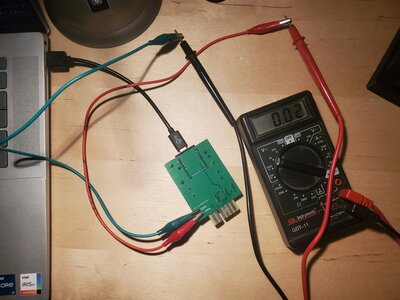_

4. Unplug the TapeMate64.

5. Add a **third clip** between the **first and last pins** of the datasette connector (simulating “Play”).

6. Plug TapeMate64 back in.  
   - You should now read something between **5–28 V**.

   _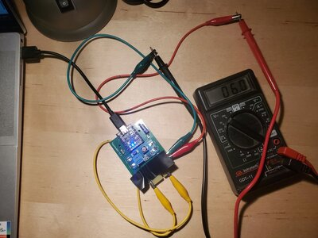_

7. Adjust the blue potentiometer on the MT3608 via the small screw:  
   - **Clockwise** → lower voltage  
   - **Counter-clockwise** → increase voltage  
   - Target: **≈ 6.0 V**

   _Tip: You may cover nearby components with electrical tape to avoid accidental shorts while adjusting with the screwdriver._

8. Unplug TapeMate64 and remove the simulated “Play” alligator cable clip.

9. Connect a **real datasette**, press **Play**, and plug TapeMate64 back in. No tape are needed inside that datasette.  
   - The motor should spin.  
   - Voltage should be slightly below 6 V.

10. Fine-tune to reach **≈ 6.0 V under load**.  
    - Make very small adjustments to avoid sudden spikes.

11. Press **Stop**.  
    - Voltage returns to **0 V**.

12. Disconnect the datasette and unplug TapeMate64.

---

## 🧱 Step 8 — Final Assembly

1. Place the TapeMate64 PCB into the enclosure.  
   - Secure using **two M2×4 mm screws** (holes on each side of the Arduino).

   _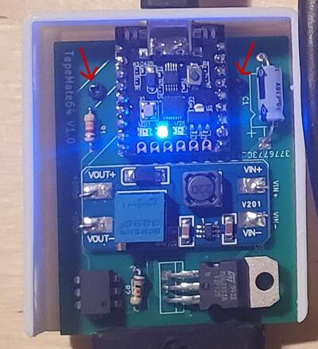_

2. ⚠️ **Avoid breaking the top-cover tabs:**  
   - Use a thin plastic ruler to gently pry the side of the case bottom while pressing the top piece in place.  

   _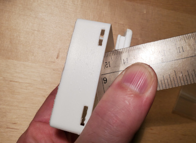_  

   - If you need to remove the cover later, slide the ruler from the back toward the front to release the clips safely.

   _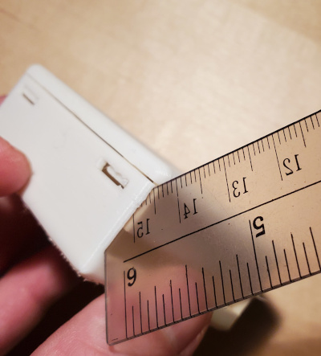_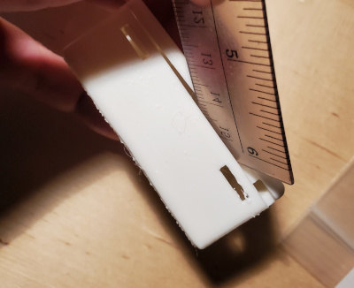_

---

## 🎉 Congratulations!

Your **TapeMate64** is now fully assembled, flashed, calibrated, and ready to use with your Commodore datasette.